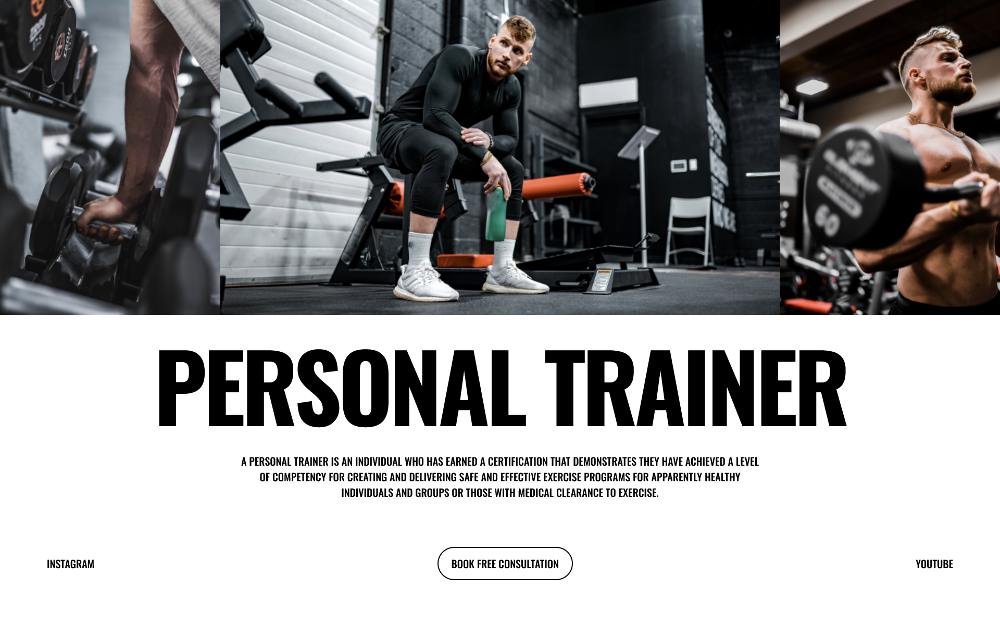

# Modern Layouts - 26/50 (#Made-In-CSS-Grid)

_50 days challenge on Modern Layouts using CSS Grid._

### Do you know??

✅ Use **ASCII ART METHOD** of CSS Grid

✅ Responsive to each breakpoints

✅ Use 12-Column grid

❌ No Absolute or Relative positioning
